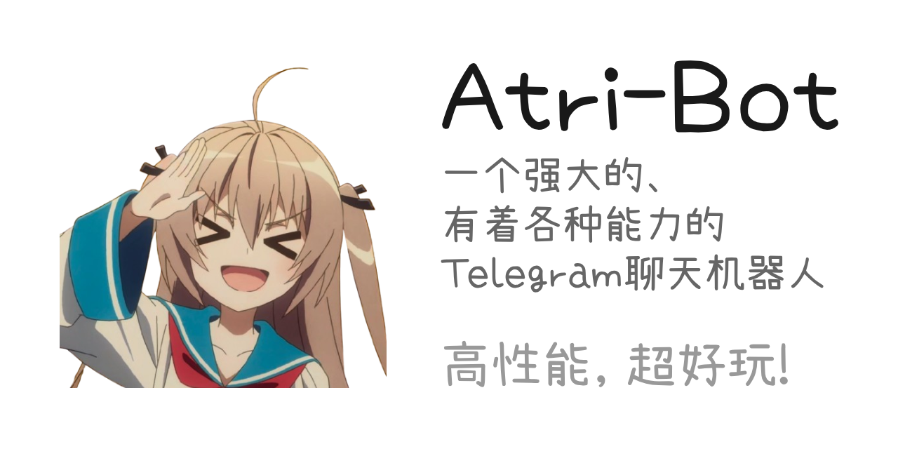

<a id="readme-top"></a>

<!-- 项目徽章 -->
[](https://github.com/chhongzh/atri-bot/graphs/contributors)
[](https://github.com/chhongzh/atri-bot/stargazers)
[](https://github.com/chhongzh/atri-bot/issues)
[](https://github.com/chhongzh/atri-bot/blob/main/LICENSE)

<br />
<div align="center">
  

  <p align="center"><small>角色为 ATRI，截图出自《ATRI -My Dear Moments-》E6 10:21</small></p>

  <p align="center">
    <a href="#快速开始">快速开始</a>
    &middot;
    <a href="https://github.com/chhongzh/atri-bot/issues">报告问题</a>
    &middot;
    <a href="https://github.com/chhongzh/atri-bot/issues">请求功能</a>
  </p>
</div>

<!-- 目录 -->
<details>
  <summary>目录</summary>
  <ol>
    <li><a href="#项目起源">项目起源</a></li>
    <li><a href="#项目简介">项目简介</a></li>
    <li><a href="#快速开始">快速开始</a></li>
    <li><a href="#使用方法">使用方法</a></li>
    <li><a href="#文档">文档</a></li>
    <li><a href="#后续计划">后续计划</a></li>
    <li><a href="#参与贡献">参与贡献</a></li>
    <li><a href="#开源协议">开源协议</a></li>
    <li><a href="#联系方式">联系方式</a></li>
    <li><a href="#致谢">致谢</a></li>
  </ol>
</details>

## 项目起源

atri-bot 的起点是《ATRI -My Dear Moments-》。玩完这部作品之后，主角 Atri 在我心里留下了很深的印象。我想让 Atri 来到现实，于是动手写了这个项目。

项目起初只是一个非常简单的 OpenAI API 封装，能在 Telegram 里回消息，仅此而已。后来它在抖音上小火了一把，收获了一些关注。说实话，当时很意外，也很感动。之后我把重心放到 v2 分支上，继续开发，一点一点把它变成现在这个样子。

现在的 atri-bot 已经是一个完整的聊天机器人，跨平台，高性能，轻量化，支持多用户、多角色、多模态。走了这么远，最初的念头一直没有变。

<p align="right">(<a href="#readme-top">回到顶部</a>)</p>

## 项目简介

atri-bot 是一个跑在 Telegram 上的角色聊天机器人。多数同类项目把功夫花在扮演上，人设丰满，台词动人，剧情能陪你演很久，但角色对现实世界没有任何手段。atri-bot
受 openclaw 这类 agent 项目的启发，在扮演能力之外加了工具能力。角色可以自己决定调用什么工具，把结果带回对话里继续聊。它是你喜欢的那个角色，同时手里有工具。

项目的出发点是把二次元角色带到现实。想要天气就自己查，想发邮件就自己发，想通过 MCP 接外部服务也可以。工具目前的重点在
MCP，内置工具里发送邮件和热点搜索已经能用，其余还在开发。

如果不想手动下载、编辑配置和管理进程，可以使用配套的 [atri-bot-launcher](https://github.com/chhongzh/atri-bot-launcher)。启动器提供桌面端和 Android 图形界面，负责下载对应版本的内核、编辑 `config.yaml`，以及启动、停止和查看日志。启动器的使用说明见它自己的 [README](https://github.com/chhongzh/atri-bot-launcher#readme)。

机器人是多用户的。每个用户有独立的 AI 连接配置、角色、会话历史和工具权限，互相不干扰。切换角色随时可以，会话历史按角色隔离，不会串戏。

### 官方实例（最后选择）

建议优先自己部署。运行只需要一个可执行文件，按下面的步骤来，几分钟就能跑起来。官方公共机器人 [@AtriBotIsAChatBot](https://t.me/AtriBotIsAChatBot)
是给想先体验、或者暂时没有条件部署的人用的，属于最后的选择。官方实例有两处限制，不允许访问内网地址，也不承诺 100%
在线，大多数时候在线。自部署没有这些限制，数据也完全在自己手里。

<p align="right">(<a href="#readme-top">回到顶部</a>)</p>

## 快速开始

直接跑二进制，或者用 Docker，两条路都能在几分钟内跑起来。详细的部署教程在 [docs/deployment.md](docs/deployment.md)，完整配置说明在
[docs/configuration.md](docs/configuration.md)。

### 直接跑二进制

1. 下载。到 Releases 页面下载对应平台的压缩包，解压后得到一个可执行文件。Windows、macOS、Linux 和 Android（arm64 / amd64）都有现成的构建产物。也可以从源码构建。

```bash
go build -o atri-bot ./cmd/atri-bot
```

2. 在运行目录创建 `config.yaml`，至少填写 bot token。

```yaml
telegram:
  bot_token: "你的 bot token"
```

3. 运行。

```bash
./atri-bot
```

4. 给你的机器人发第一条消息。第一个交互的用户自动成为管理员，管理员可以管理其他用户的权限和 MCP 设置。

### 用 Docker 跑

```bash
docker pull ghcr.io/chhongzh/atri-bot:latest
mkdir -p /data/atri
# 先把 config.yaml 放进 /data/atri，再启动
docker run -d --name atri-bot \
  -e TZ=Asia/Shanghai \
  -v /data/atri:/data \
  --restart unless-stopped \
  ghcr.io/chhongzh/atri-bot:latest
```

镜像默认时区是 `Asia/Shanghai`，可以用 `-e TZ=...` 覆盖。配置、数据库和媒体都放在挂载目录里。docker compose 示例和完整说明见
[docs/deployment.md](docs/deployment.md)。

<p align="right">(<a href="#readme-top">回到顶部</a>)</p>

## 使用方法

所有命令都通过文本消息发送，参数支持引号，带空格的参数用引号包起来。发送 `/help` 可以按权限查看当前可用的命令列表。

主要命令一览。

- `/ai show|base-url|key|model|rounds|image-size` 查看或修改自己的 AI 配置。
- `/characters` 列出所有可用角色。
- `/character <角色ID>` 查看详情或切换角色。
- `/toolperm list|allow|deny|reset` 管理员管理用户工具权限。
- `/mcp show|limit` 管理员管理用户 MCP 设置。
- `/providers`、`/provider add|set|remove|refresh` 管理员管理角色来源。
- `/admin stats|promote|demote|ban|unban|delete`、`/users`、`/user`、`/admins`、`/active-users` 管理员管理账户和运行状态。

命令的详细用法、工具与 MCP、角色与 chardef 见 [docs/usage.md](docs/usage.md)。

<p align="right">(<a href="#readme-top">回到顶部</a>)</p>

## 文档

- [部署教程](docs/deployment.md) 二进制部署、Docker 部署、docker compose 示例、时区与升级。
- [配置说明](docs/configuration.md) config.yaml 全部字段和默认值。
- [命令与工具](docs/usage.md) 命令、AI 配置、角色与 chardef、工具与 MCP。

<p align="right">(<a href="#readme-top">回到顶部</a>)</p>

### 明确不做的事

插件系统不打算做。插件能提供的能力，MCP 都能提供，角色通过 MCP 接外部服务已经覆盖了这部分场景。Web 管理界面同样不打算做，配置用
Telegram 里的命令就够，没必要再做一个网页。

<p align="right">(<a href="#readme-top">回到顶部</a>)</p>

## 参与贡献

任何形式的贡献都欢迎，代码、文档、测试、问题反馈都可以。最轻的入门方式是去 [mihari-bot/chardef](https://github.com/mihari-bot/chardef)
写一个角色，或者改进现有角色的提示词。这不碰代码，却直接决定角色的体验。

代码贡献的流程和其他开源项目一样。先 fork，再开分支，最后提 Pull Request。

1. Fork 项目仓库。
2. 创建功能分支（`git checkout -b feature/你的功能`）。
3. 提交修改。
4. 推送到分支。
5. 开一个 Pull Request。

报告问题或请求功能，直接开 [issue](https://github.com/chhongzh/atri-bot/issues)，写清楚复现步骤就行。

### 发布

在 GitHub Actions 中手动触发 goreleaser 时只构建 snapshot，不创建 Release。推送 tag 时才正式发布。Android 产物在 CI 中用 Android
NDK 交叉编译。正式发布还会构建 `linux/amd64`、`linux/arm64` 的 Docker 镜像，推送到
`ghcr.io/chhongzh/atri-bot`，打上版本号和 `latest` 标签。

<p align="right">(<a href="#readme-top">回到顶部</a>)</p>

## 开源协议

项目以 MIT 协议开源，详见 [LICENSE](LICENSE)。商用、修改、分发都允许，保留版权声明即可。

<p align="right">(<a href="#readme-top">回到顶部</a>)</p>

## 联系方式

官方机器人是 [@AtriBotIsAChatBot](https://t.me/AtriBotIsAChatBot)
，项目主页在 [https://github.com/chhongzh/atri-bot](https://github.com/chhongzh/atri-bot)。欢迎到仓库的 issue 区反馈问题。

<p align="right">(<a href="#readme-top">回到顶部</a>)</p>

## 致谢

- [mihari-bot/chardef](https://github.com/mihari-bot/chardef) 社区提供的角色定义与规范。
- [Best-README-Template](https://github.com/othneildrew/Best-README-Template) 提供的 README 结构。
- openclaw 这类 agent 项目，启发了角色调用工具的设计。

<p align="right">(<a href="#readme-top">回到顶部</a>)</p>
